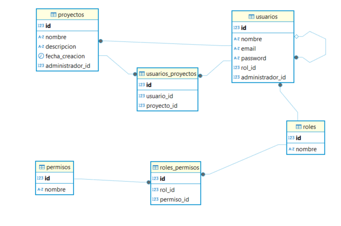

# admin-access-project-frontend

# Proyecto Angular con TypeScript

Este proyecto es una aplicación Angular creada con TypeScript.

## Requisitos

- Node.js (versión 18 o superior)
- npm (versión 10 o superior)

## Instalación

1. Clona el repositorio:

   ```sh
   git clone https://github.com/jgomez04/admin-access-project-frontend.git
2. Ingresa al repositorio clonado:

    ```sh
    cd admin-access-project-frontend
3. Instala las dependencias:
    ```sh
    npm install
4. Ejecuta en desarrollo
    ```sh
    ng s 
5. Abre la aplicación en el puerto asignado. Ejemplo:

    [http://localhost:5173/](URL)

6. 
- Node.js + Express + PostgreSQL (Sequelize)
- Autenticación con JWT y bcryptjs
-Estructura modular

7. Diagrama entidad relación
 
